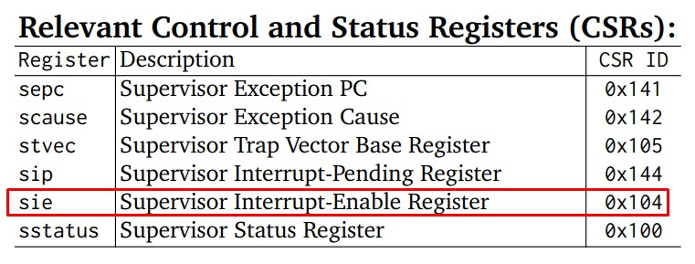

# Periféricos e Interrupções

Um {pink}(periférico) é um conjunto de registos, periféricos diferentes têm registos diferentes. Os registos do periférico são diferentes dos registos do processador.

.jpg>)

Os registos dos periféricos são mapeados numa gama de endereços específica.
Para aceder aos dados na memória utilizamos as instruções convencionais: **lw** e **sw**, mas para realizar a leitura/escrita de dados no periféricos existem instruções específicas:

```asm6502
iolw Xn, xpto -> leitura do registo com o endereço xpto

iosw Xn, xpto -> escrita no registo
```

::: details Saber para o teste

- {pink}(**Port-Mapped I/O**): Barramentos independentes de acesso à memória e aos periféricos

- {orange}(**Memory-Mapped I/O**): Barramento único para acesso à memória e aos periféricos.

:::

.jpg>)
.jpg>)
.jpg>)
.jpg>)
.jpg>)

## Interrupções e Exceções

{green}(Interrupções) - Evento desencadeado por uma entidade exterior ao processador.  
Ex: O utilizador mexeu no rato ou inseriu uma pen USB

{blue}(Exceções) - Evento gerado em consequência da execução de uma instrução.  
Ex: Divisão por 0 ou a execução de uma instrução "ilegal"

### Para resolver a Interrupção ou Exceção:

1. Termina a execução atual
2. Chama a {orange}(sub-rotina) que atende a interrupção
3. Retorna ao ponto inicial executando a instrução seguinte

Esta {orange}(sub-rotina) **não** deve:

- Alterar qualquer registo do processador
- Alterar a stack

Mas deve:

- Guardar o endereço de retorno (No RISC-V, **SEPC**)
- O **PC** passa a apontar para a 1ª instrução da rotina do tratamento de interrupções
- Salvaguardar na pilha o registo de todos os endereços alterados pela rotina de interrupções
- Consultar o registo **SCAUSE** que nos indica a causa da interrupção
- Realizar o processamento relativo à rotina de interrupções
- Repor o contexto
- Retornar ao programa original (**SRET: PC <- SEPC**)

## Control and Status Registers (CSR's)

- {yellow}(SIE) (_Supervisor Interrupt-Enable Register_) - Permite ativar ou desativar **todas** as interrupções/exceções globais ou ativar/desativar apenas de um periférico específico

- {yellow}(SIP) (_Supervisor Interrupt-Pending Register_) - Permite saber se existe uma interrupção/exceção por atender

- {yellow}(SSTATUS) (_Supervisor Status Register_) - Contém o {orange}(GIE) (_Global Interrupt Enable_) e o {orange}(SPIE) (_Global Prior Interrupt Enable_).
  O {orage}(SPIE) contém o valor lógico do bit GIE antes de atendermos a interrupção.

- {yellow}(STVEC) (_Supervisor Trap Vector Base Register_) - Guarda o endereço da 1ª instrução da rotina de tratamento

- {yellow}(SEPC) (_Supervisor Exception PC_) - Guarda o endereço de retorno

::: details Exemplo:


```js
// Indique o número e valor de todos os registos escritos
// pela execução do troço de código indicado:

li x10, 0x000F 0000
csrrs x0, 0x104, x10
```

Indo ao Reference Card, podemos tirar que _csrrs_ corresponde a um _CSR Read and Set_ da forma `csrrs xd, csr, xa`. Assim, o ID do CSR corresponde a _0x104_ o que corresponde a um _SIE_.



Como, pela primeira imagem, temos que `CSR[csr] ← CSR[csr] | xa` e o ID do CSR corresponde a um SIE, substituindo temos:

```js
SIE = SIE | x10  ⇔  SIE = 000F 0000h
```

Olhando para a imagem do enunciado, temos que SIP = 0004 0000h e que SSTATUS = 0000 0002h = (...) 00{red}(1)0 , este bit equivale ao GIE $\implies$ GIE = 1.

Assim, podemos concluir que há uma interrupção pendente associada ao periférico/excepção 18 (isto porque se convertermos o SIP para binário temos 0{red}(1)00 0000 0000 0000 0000, ou seja, o 18º bit está a 1) e, por isso, chama-se a rotina de interrupções.


- O SEPC correponde ao endereço da instrução a seguir ao _csrrs_, como o PC se encontrava em 0000 014Ch, somando 2 instruções ficamos com SEPC = 158h.
- O PC aponta para a 1ª instrução da rotina de interrupções que está guardado no STVEC: PC $\gets$ STVEC $\implies$ PC = 000A 0000h (pela imagem do enunciado).
- O SPIE corresponde ao valor lógico de GIE _antes_ de atender a interrupção, $\implies$ SPIE = 1
- Pelo Reference Card, podemos concluir que o {green}(5º) e o {blue}(1º) bits do SSTATUS correpondem ao SPIE e ao GIE, respectivamente. Assim, temos que SPIE = (...)00{green}(1)0 00{blue}(0)0 = 0000 0020h.
