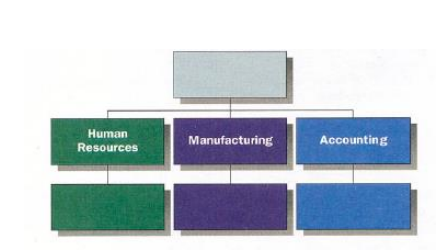
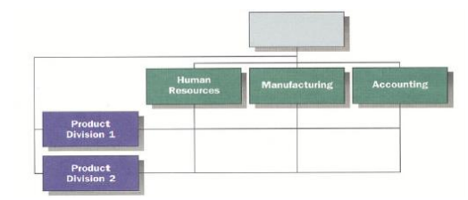
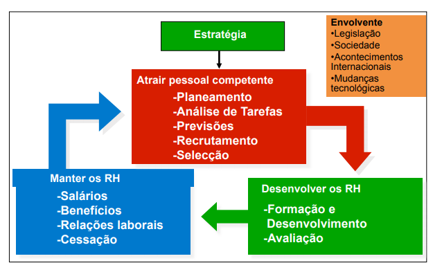

# Organizações e Recursos Humanos

## Cultura, ética e estrutura das organizações

Cada empresa/organização é influenciada por:

- **Elementos externos**: A forma como um local condiciona ou permite a atividade de uma empresa.

* **Elementos internos**: Capacidade de se adaptar às alterações decorrentes da influência externa. Envolvem nomeadamente a cultura da organização, a sua estrutura organizativa, os trabalhadores e a gestão.

## Cultura organizacional, ética e responsabilidade social

- **Cultura da organização**: Conjunto de valores, crenças e regras que os membros de uma organização partilham que podem ser expressos através de elementos visiveis (Símbolos, Histórias, Cerimónias) e invisiveis (Convicções).

* **Ética**: Código de conduta/principios morais e dos valores pelos quais os indivíduos e grupos regem o seu comportamento. Faz parte da cultura e condiciona as decisões que dizem respeito à forma de atuação da empresa no desenvolvimento dos seus negócios e à responsabilidade social interna ou externa. Muitas vezes podem surgir dilemas éticos que são conflitos de valores entre individuos. As escolhas éticas são influenciadas pela mentalidade do gestor, pela cultura da empresa, etc.

- **Responsabilidade Social**: Responsabilidade dos gestores em fazerem escolhas e promoverem ações que contribuem para o bem-estar e interesses da sociedade e da organização. Numa definição menos formal, podemos dizer que caem no âmbito da responsabilidade social decisões que vão para além do previsto e estipulado, por exemplo, questões ambientais, atividades em benefício da sociedade, respeito para os consumidores.
  ::: tip Por exemplo:
  O IST preza-se pela sua excelência, pela formação teórica e prática de elevado nível dos seus alunos (elemento invisisel de cultura), tem como sua marca o logótipo que desde o início inclui o símbolo da integral e as cores azul e branco (elemento visivel de cultura). Esta instituição é considerada bastante séria e assume uma posição antipraxe (Código moral - Ética). O facto de garantir que todos os alunos tenham acesso aos seus professores num horário de dúvidas que deve ser estipulado, distingue-o das demais faculdades (Responsabilidade Social).
  :::

## Estrutura Organizacional

- Forma pelo qual as atividades desenvolvidas por uma organização são divididas, organizadas e coordenadas. A representação visual de uma estrutura organizacional chama-se **organograma**.
  São elementos da estrutura organizacional:
- **Especialização do trabalho**: O grau com que as tarefas da organização são divididas em trabalhos individuais.

::: tip Por exemplo:

Na AutoEuropa cada técnico trabalha numa máquina em que é especializado.

:::

- **Cadeia de Comando**: Linha de autoridade, a partir do topo passando pelos vérios níveis da organização, que clarifica quem responde perante quem.

::: tip Por exemplo:
Presidente da República > Primeiro Ministro > Ministros > Secretários > etc.
:::

- **Amplitude de Controlo**: Número de pessoas a que um gestor se pode dirigir de forma eficaz e eficiente. Divide-se em dois tipos:

  - **Estrutura alta**: Empresa com 341 pessoas, divididas em 3 niveis organizacionais em que cada pessoa delega 4 pessoas.

  - **Estrutura baixa/plana/horizontal**: Empresa de 157 pessoas divididas em 3 niveis organizacionais em que cada pessoa delega 12 outras pessoas. Com este método a empresa tem uma estratégia orientada para a diferenciação e inovação.

A amplitude de controlo diz-se mais reduzida quando os elementos da mesma equipa desempenham tarefas complexas e independentes.

- **Centralização**: Localização da tomada de decisões (niveis hierárquicos superiores).
  ::: tip Por exemplo:
  Se as decisões forem tomadas pelo presidente da empresa então esta é centralizada.
  :::

* **Descentralização**: Dispersão das tomadas de decisão pelos membros da organização.

- **Formalização**: O grau com que os trabalhos da organização estão padronizados.
  ::: tip Por exemplo:
  Ao telefonar para a Saúde24, todos os pacientes serão interrogados com as mesmas questões de forma a discriminar eficientemente cada caso.
  :::

* **Departamentalização**: A base de agrupamento de tarefas em departamentos e destes na organização de acordo com a cadeia de comando desejada.

- **Sistemas de Coordenação**: Colaboração, comunicação entre os vários departamentos.

## Tipos de Estrutura

1. Vertical Funcional

   - **Vantagens**: Especialização dos empregados. Economias de Escala.
   - **Desvantagens**: Fraca comunicação dos departamentos.

   

2. Divisional

   - **Vantagens**: Flexibilidade, adaptação.
   - **Desvantagens**: Duplicação de recursos, fraca coordenação entre divisões.

     

3. Maticial

   - **Vantagens**: Interdisciplinaridade.
   - **Desvantagens**: Conflitos na cadeia de comando.

   

4. Trabalho em Equipa

   - **Vantagens**: Rapidez de resposta, entusiasmo dos membros.
   - **Desvantagens**: Tempo em reuniões, conflitos eventuais.

   

5. Rede Virtual

   - **Vantagens**: Flexibilidade; Poucos custos estruturais.
   - **Desvantagens**: Difícil coordenação e controlo.

- Empresas com esta estrutura costuma recorrer ao **outsourcing** que consiste na contratação de um conjunto de atividades como especialistas em formação e engenheiros, para se focar na sua atividade principal.

## Gestão de Recursos Humanos

A gestão de recursos humanos inclui a concepção e implementação de sistemas formais que permitam a utilização do talento e capacidades das pessoas, de forma eficiente e eficaz, para atingir as metas da organização. A estratégia da gestão de recursos humanos passa pelas seguintes etapas:

Na etapa de atração de pessoal competente podemos distinguir vários processos, entre os quais:

1.  **Planeamento**: Inclui as previsões das necessidades da organização, a curto, médio e a longo prazo, por:

    - Tipo de Competências;
    - Número de pessoas necessárias;
    - Duração das necessidades;

2.  **Análise de tarefas**: Descrição de tarefas para detetar sobreposições e vazios, e permitir o adequado recrutamento e seleção de pessoal. Isto compreende uma **descrição do trabalho** - descrição concisa das tarefas, deveres e responsabilidade do trabalho - e a **especificação do trabalho** - Descrição dos conhecimentos, competências e capacidades necessárias para o desempenho do trabalho.

3.  **Recrutamento**: Este pode ser **interno**, quando se promove os trabalhadores da próxima organização para cargos mais elevados, ou **externo**, quando se convida pessoas externas à organização para ocupar cargos. Cada tipo de recrutamento tem as suas vantangens e desvantagens.

### Recrutamento Interno

**Vantagens**:

    - Custos baixos;
    - Aumento da motivação e do empenho dos membros;
    - Manutenção da cultura da organização.

**Desvantagens**:

    - Não permite a renovação de pessoas.

### Recrutamento Externo

**Vantagens**:

    - Renovação de competências;
    - Introdução de novas ideias;

**Desvantagens**:

    - Não ocorre a renovação pretendida;
    - Desadaptação à cultura da empresa;
    - Mais caro;

Na etapa de desenvolvimento dos recursos humanos distingue-se:

- **Formação interna/externa**: A existência de aprendizagem em aulas, formação dos trabalhadores de modo a que estes possam evoluir na sua carreira.

* **Avaliação de desempenho**: O processo de observação e valorização do desempenho dos empregados; registo do desempenho; informação dos avaliados e aos gestores responsáveis na tomada de decisões com base nos desempenhos dos individuos. Os sistemas de avaliação devem ser objetivos/claros, adaptados às mudanças das condições e dos requisitos para o exercicio de tarefas. A avaliação deve refletir bem o desempenho de um empregado de forma a que este seja motivado por ela nunca desmotivado.
